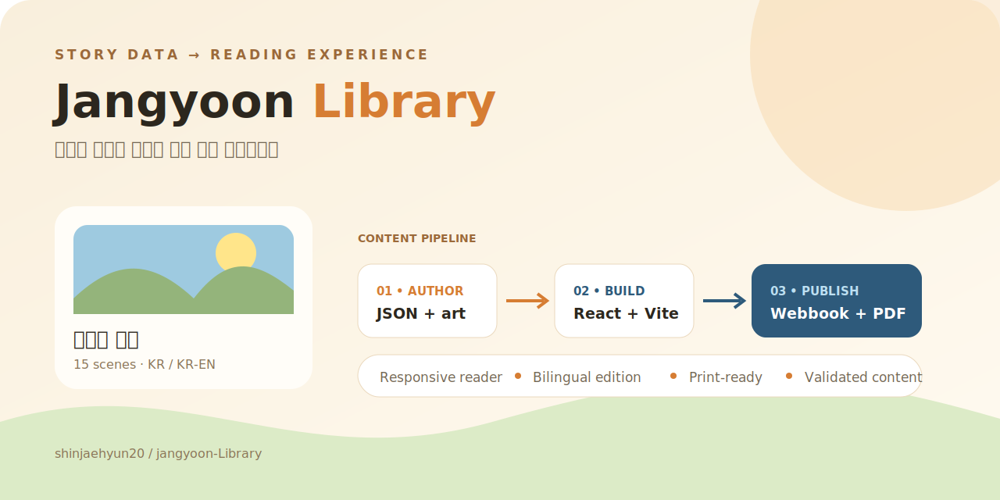
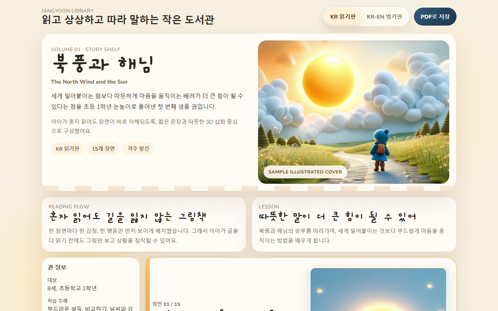

# Jangyoon Library

> 한 권의 이야기 데이터를 반응형 웹북·한영 읽기판·인쇄용 PDF로 만드는 재사용형 어린이 콘텐츠 파이프라인.

[](package.json)
[](package.json)
[](#검증)
[](https://shinjaehyun20.github.io/jangyoon-Library/)
[](LICENSE)

[](https://shinjaehyun20.github.io/jangyoon-Library/)

**[샘플 웹북 읽기](https://shinjaehyun20.github.io/jangyoon-Library/)** · [콘텐츠 스키마](src/data/books/north-wind-and-the-sun.json) · [다음 권 템플릿](templates/) · [QA 체크리스트](docs/)

| 입력 | 변환 | 결과 |
| --- | --- | --- |
| 장면 JSON, 메타데이터, 삽화 | React reader + Vite build | 반응형 웹북 |
| 한국어·영어 문장 | edition toggle | KR / KR-EN 읽기판 |
| 동일한 웹 콘텐츠 | Playwright print flow | 인쇄 친화 PDF |

아이 친화형 콘텐츠 생태계에서 **이야기·삽화·학습 메타데이터를 반복 생산 가능한 형태로 묶는 라이브러리 레이어**입니다. 샘플 한 권을 보여주는 데서 끝나지 않고, 다음 권을 만들 수 있는 데이터·템플릿·검증 흐름을 함께 둡니다.



## 배포 주소
- GitHub Repository: `https://github.com/shinjaehyun20/jangyoon-Library`
- GitHub Pages: `https://shinjaehyun20.github.io/jangyoon-Library/`

## 현재 포함 내용
- 모바일/PC 동시 대응 반응형 웹북
- `KR 읽기판` / `KR-EN 병기판` 토글
- 인쇄 친화형 PDF 출력 버튼
- 샘플 권 `북풍과 해님`
- 장면/메타데이터/ComfyUI/웹 리더/PDF 스펙 템플릿
- 실제 생성 삽화 `cover + scene-01 ~ scene-15`
- GitHub Pages 배포 스크립트

## 샘플 권
- 제목: `북풍과 해님`
- 원전: `Aesop's Fables - The North Wind and the Sun`
- 공개 활용 근거: `Wikisource 공개 도메인 텍스트를 아동용으로 재구성`
- 대상: `8세, 초등학교 1학년`

## 실행
```bash
npm install
npm run dev
```

## 검증
```bash
npm run validate:content
npm run build
```

검증 범위는 책 JSON의 필수 필드·장면/삽화 참조와 Vite production bundle 생성입니다.

## PDF 출력
```bash
npm run export:pdf
```

생성된 PDF는 `outputs/` 아래에 저장됩니다.

## 삽화 생성
로컬 SD 3.5 기반 삽화 생성 스크립트:

```bash
scripts\run_generate_story_illustrations.bat
```

직접 실행 파일:
- `scripts/generate_story_illustrations.py`
- Python env: `D:\workspace\env\python\py310-torch\Scripts\python.exe`
- 모델 루트: `D:\workspace\tools\ComfyUI`

생성 결과는 아래 경로에 저장됩니다.
- `public/illustrations/volume-01`

## GitHub Pages 배포
```bash
npm run deploy
```

배포 기본 경로는 `/jangyoon-Library/`로 설정되어 있습니다.

## 주요 폴더
- `src/`: 웹북 앱 소스
- `src/data/books/`: 책 데이터 JSON
- `public/illustrations/volume-01/`: 실제 삽화 PNG
- `scripts/`: 검증, PDF, 삽화 생성 스크립트
- `templates/`: 다음 권 제작용 템플릿
- `docs/`: 운영 가이드와 QA 체크리스트
- `outputs/`: PDF 출력물

## 아키텍처

```text
src/data/books/*.json ─┬─> React reader ─> Vite dist ─> GitHub Pages
public/illustrations/ ─┘          └──────> print stylesheet ─> PDF
templates/ + scripts/ ───────────> next-volume authoring + validation
```
